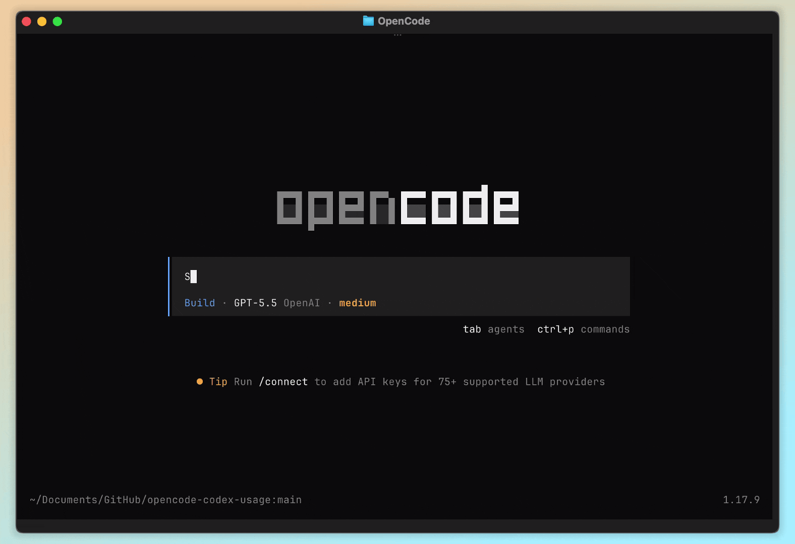

# opencode-codex-usage-plugin

<p align="center">
  Show your Codex usage and reset times directly in the OpenCode sidebar.
</p>

<div align="center">
  
</div>

This plugin reads Codex usage from Codex App or the Codex CLI and renders the current 5-hour and weekly limits inside OpenCode, so you can keep an eye on quota without leaving the TUI.

## Install

Add the plugin to your OpenCode config:

```json
{
  "$schema": "https://opencode.ai/config.json",
  "plugin": ["opencode-codex-usage-plugin"]
}
```

Restart OpenCode after changing the config.

## Requirements

Install either Codex App or the Codex CLI. The plugin looks for Codex in common locations and on your `PATH`.

If your Codex command lives somewhere else, set `OPENCODE_CODEX_USAGE_COMMAND` in your shell config:

```sh
# ~/.zshrc or ~/.bashrc
export OPENCODE_CODEX_USAGE_COMMAND="/path/to/codex"
```

Then reload your shell config or open a new terminal before starting OpenCode.
